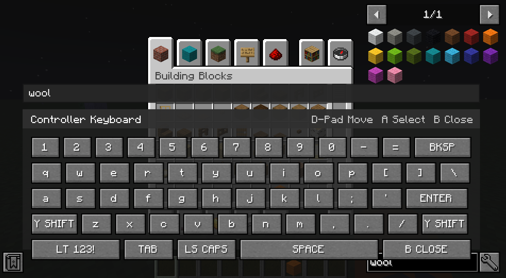

# Keyboardable - Controllable Addon (Forge 1.20.1)

This mod is a client-side addon intended for use with `controllable`.

## Preview

## Implemented behavior

- Full keyboard overlay with controller-friendly row/column navigation.
- Dedicated symbol page toggle (`123!` <-> `ABC`).
- Auto-opens when a text input target is present (e.g. edit boxes and sign screens).
- Blocks all underlying mouse/key/scroll interaction while visible.
- Cancels tooltips while visible so keyboard remains the only active hover target.

## Compatibility intent

- Minecraft: 1.20.1
- Forge: 47.x
- Controllable: 0.21.9+

## Notes

- Keybindings are exposed under category `Keyboardable Addon`.
- Overlay visibility can be toggled manually with the toggle keybind.
- This is a base implementation and can be extended with gamepad glyphs, hold-repeat, and smoother focus wrap logic.
